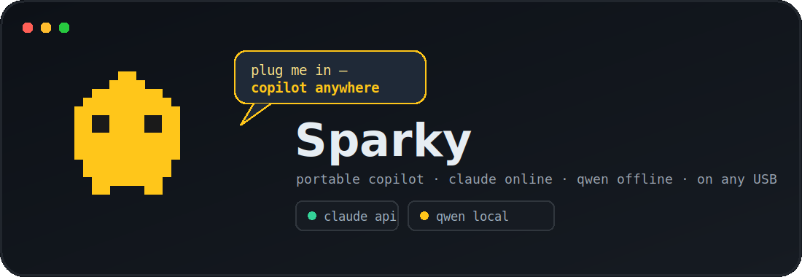

<p align="center">
  
</p>

<p align="center">
  <b>Sparky</b> is a Claude-Code-style AI coding copilot that runs from a USB stick on
  <b>any computer</b> — Linux, macOS, or Windows — with <b>no install and no login</b>.
  Plug it in, run one command, and you have a real agentic copilot that reads and edits
  files, runs commands, and searches code.
</p>

<p align="center">
  🌐 <b>Online → Claude API.</b>  📡❌ <b>Offline → local Qwen.</b>  It switches
  <b>automatically, mid-session</b>, the moment your connection drops or comes back.
</p>

---

## One command, every device

Sparky ships a single self-detecting launcher — the same file runs on all three
operating systems:

```bash
# macOS / Linux
./sparky.cmd

# Windows (or just double-click it)
sparky.cmd
```

`sparky.cmd` is a polyglot: a POSIX shell script *and* a Windows batch file at once.
It detects the OS, picks the right bundled runtime, starts the local model in the
background, and launches the copilot. Nothing is installed on the host machine.

## What it does

- 🧠 **Claude when online** — the Claude API (default Sonnet; `/model opus` to switch).
- 📡 **Qwen when offline** — a bundled `qwen2.5-coder:3b` via a bundled Ollama. If the
  network drops *mid-session*, the next reply just keeps going on the local model,
  tagged `(fallback)`. The header always shows `● online` / `● OFFLINE`.
- 🛠 **Real coding agent** — tools for read / write / edit files, list dirs, search, and
  run shell commands (with an approval prompt unless you `/yolo`).
- 🖼 **Text *and* image prompts** — attach a screenshot with `/img shot.png what's this?`
  (images go to Claude when online).
- 📂 **Per-drive context folder** — drop notes, specs, or code into `context/` on the
  stick and Sparky loads them into every session automatically.
- 🔒 **Zero footprint** — `HOME`, config, caches, and the model all live on the stick;
  your host machine stays untouched.

| | Online | Offline (no Wi-Fi) |
|---|---|---|
| **Model** | Claude API (Sonnet / Opus) | local `qwen2.5-coder:3b` via Ollama |
| **Switch** | default when reachable | automatic on connection loss, mid-session |
| **Images** | ✅ sent to Claude | ⚠️ noted as needing connectivity (text answered locally) |

## Set up a stick

Plug in a USB drive and name its volume **`Sparky`**. **Format it as exFAT**
(recommended): exFAT is cross-platform, supports files >4GB, and — unlike FAT32 —
mounts executable on Linux, which the bundled local model needs for **offline** mode.
Online (Claude) works on FAT32 too; if your stick is FAT32 and you want offline on
Linux, run `sudo tools/format_exfat.sh` once to convert it (it backs up, reformats,
and restores). Then:

```bash
# macOS / Linux — wipes the stick, installs Sparky, fetches the runtime + model
tools/setup_usb.sh            # add --cross to bundle macOS+Windows runtimes too
```
```powershell
# Windows
powershell -ExecutionPolicy Bypass -File tools\setup_usb.ps1
```

Setup downloads a relocatable Python, the pure-Python deps, the Ollama binary, and
pulls the Qwen weights **onto the stick** — so a brand-new *offline* machine works on
first plug-in (after the one-time per-OS setup while you have internet).

The first time you launch on a new OS, Sparky auto-fetches that OS's runtime if it's
missing (needs internet once); afterwards it's cached on the stick and works offline.

## Configure the API key

On first launch with internet, Sparky asks you to paste an Anthropic API key (get one
at <https://platform.claude.com>). It's stored only in `data/sparky.env` on the stick
(`chmod 600`) and never leaves it.

> ⚠️ A live key on a portable stick is spendable by anyone who finds it. If you lose
> the stick, revoke the key in the Claude dashboard.

## In-session commands

| Command | Action |
|---|---|
| `/help` | list commands |
| `/model [sonnet\|opus\|<id>]` | switch the online model |
| `/img <path> [message]` | attach an image to the next message |
| `/context` | show what's loaded from `context/` |
| `/yolo` | toggle auto-approval of shell commands |
| `/clear` · `/quit` | clear history · exit |

Run `python -m sparky --self-test` (or `sparky.cmd --self-test`) to check the runtime,
key, connectivity, and local model.

## On-stick layout

```
Sparky/
├── sparky.cmd          ← the one launcher (Linux/macOS/Windows)
├── start.sh START.bat start.command   per-OS entry points it dispatches to
├── sparky/             the Python app (router, providers, agent, tools, TUI)
├── context/            ← drop files here; auto-loaded every session
├── runtime/            bundled portable Python + Ollama + Qwen weights (gitignored)
├── data/               key, sessions, redirected HOME/config (gitignored)
└── tools/              setup_usb.sh / .ps1, fetch_runtime.sh
```

## How it works

```
        you type / drop an image
                 │
                 ▼
      agent loop (tool use: read·write·edit·search·run)
                 │
                 ▼
        ┌──────  router  ──────┐
   online + key │              │ offline / API error
                ▼              ▼
        Claude API        local Qwen (Ollama)
     (Sonnet / Opus)      qwen2.5-coder:3b
                 │              │
                 └──── reply ───┘  ● online / ● OFFLINE shown live
```

The router checks connectivity on a background thread; every turn picks Claude when
reachable and falls back to Qwen on any error — so a session that starts online and
loses Wi-Fi finishes locally without you doing anything.

Built on the principles of
[OpenClaude-Portable](https://github.com/techjarves/OpenClaude-Portable); themed after
the author's `interview-copilot` (Sparky 🐤). Tests: `python -m pytest` (27 passing).
