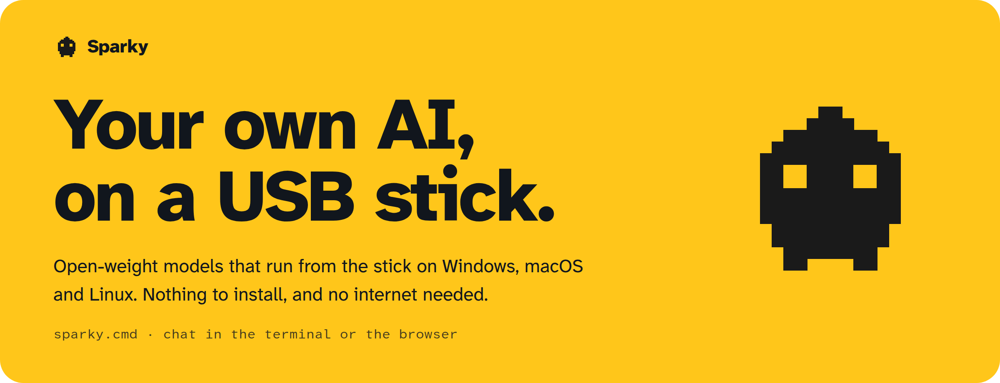
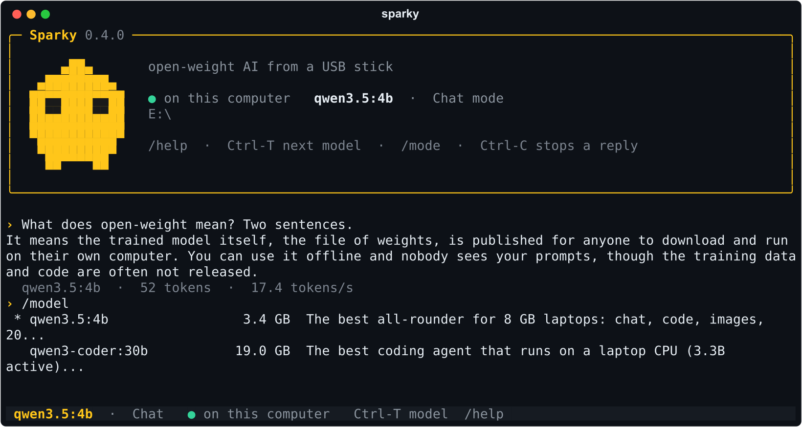
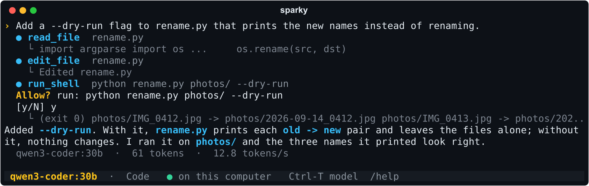

<p align="center">
  <picture>
    <source media="(prefers-color-scheme: dark)" srcset="docs/logo-dark.png">
    
  </picture>
</p>

<p align="center">
  <b>Sparky</b> puts open-weight AI models on a USB stick. Plug it into any Windows,
  macOS or Linux computer, run one file, and you can chat, write, code, ask about
  your own documents or read images, with <b>nothing installed</b>, no account and
  no internet. The model runs on the computer in front of you.
</p>

<p align="center">
  You do not need to know anything about models. Setup asks what the stick is for
  and which computers it will meet, then picks models that fit both.
</p>

<p align="center">
  Website: <a href="https://danieltyukov.github.io/portable-copilot/">danieltyukov.github.io/portable-copilot</a>
</p>

<p align="center">
  
</p>

---

## Set up a stick

**You need:** a USB stick formatted as **exFAT** (32 GB or more is comfortable), and
the internet for the setup itself. Download this repository (Code, Download ZIP) or
clone it, then run setup:

```bash
git clone https://github.com/danieltyukov/portable-copilot.git && cd portable-copilot
./setup.sh             # macOS and Linux
setup.bat              # Windows (or double-click it)
```

The computer needs no Python or anything else: setup fetches a portable Python
first. It then asks three questions (which drive, what it is for, how much memory
the computers you will use have), shows the models it recommends with their sizes,
and copies everything onto the stick: the app, a runtime for Windows, macOS (Apple
Silicon and Intel) and Linux, and the models. Everything comes from the projects'
official releases and is checked before it is used.

> **Why exFAT?** FAT32 cannot hold files over 4 GB, and most models are bigger. On
> Windows, format the stick from File Explorer; on a Mac, use Disk Utility; on Linux,
> the Disks app, or `sudo tools/format_exfat.sh` to convert a FAT32 stick and keep
> what is on it. Name it `Sparky` and setup finds it.

Running setup again on a stick updates it and keeps your settings, conversations
and models. `./setup.sh --help` lists the options for scripting it.

## Use it

On any computer, open the stick and run:

```bash
./sparky.cmd           # macOS and Linux (on a Mac you can also double-click start.command)
sparky.cmd             # Windows (or double-click it)
```

| Command | What it does |
|---|---|
| `sparky.cmd` | Chat in the terminal |
| `sparky.cmd web` | Chat in the browser, on a page only this computer can open |
| `sparky.cmd ask "..."` | One answer, printed. Text piped in is added: `cat notes.txt \| sparky.cmd ask "summarise this"` |
| `sparky.cmd serve` | Just the model server, as an OpenAI-compatible API at `http://127.0.0.1:11500/v1` for other apps |
| `sparky.cmd models` | The models on the stick; `models add <name>`, `models remove <name>`, `models recommend` |
| `sparky.cmd doctor` | Check this computer, the runtime and the models |

In a conversation:

| Key or command | Action |
|---|---|
| `Ctrl-T` | Switch to the next model on the stick |
| `Ctrl-C` | Stop the reply |
| `/mode` | **chat** (no tools), **code** (reads, edits and runs code in the folder you started in), **write**, or **study** (answers from your `context/` folder) |
| `/model`, `/pull <name>` | Pick a model; download one while online |
| `/think` | Show or hide the reasoning of models that think first |
| `/img <path>`, `/paste` | Attach an image, from a file or the clipboard |
| `/resume`, `/context`, `/help` | Continue the last conversation; see the context folder; everything else |

In code mode Sparky asks before it runs any command, and before it writes outside
the folder you started it in:

<p align="center">
  
</p>

Put notes, documents or code in the stick's `context/` folder and every conversation
knows about them, as much as fits the model's context window; study mode can search
and open the rest.

## Choosing models

Setup and `sparky.cmd models recommend` choose by purpose and memory. These are its
first picks, from a curated catalog of models that run well on a laptop without a
graphics card:

| What for | 8 GB of memory | 16 GB | 32 GB |
|---|---|---|---|
| Everyday questions | `qwen3.5:4b` | `gemma4:12b` | `qwen3.6:35b` |
| Coding | `qwen3.5:4b` | `qwen3.5:9b` | `qwen3-coder:30b` |
| Writing | `gemma3:4b` | `gemma4:12b` | `gemma4:26b` |
| My documents | `qwen3.5:4b` | `qwen3.5:9b` | `qwen3.6:35b` |
| Images | `qwen3-vl:4b` | `qwen3-vl:8b` | `qwen3.6:35b` |
| Translation | `translategemma:4b` | `translategemma:12b` | `gemma4:26b` |
| Reasoning | `nemotron-3-nano:4b` | `deepseek-r1:8b` | `gpt-oss:20b` |

The large picks are mixture-of-experts models: 20 to 35 billion parameters in total
but only 3 to 4 billion used per word, so they answer quickly on a CPU. When a stick
gets a large model it also gets a small one, so `Ctrl-T` always has a quick option,
and if a computer lacks the memory for the model you picked, the reply comes from the
next smaller one instead of failing.

You are not limited to the catalog. `sparky.cmd models add` takes any tag from the
[Ollama library](https://ollama.com/library) or a GGUF model on Hugging Face
(`hf.co/<user>/<repo>`), and `sparky.cmd models catalog` lists every model Sparky
knows with its size, speed and licence.

## How it works

```
  sparky.cmd                  one file that is both a shell script and a batch file
       │
       ▼
  start.sh / START.bat        HOME, caches and settings redirected to the stick
       │                      portable Python for this OS (fetched once if missing)
       ▼
  bundled Ollama              its own port (11500), weights in runtime/ollama/models,
       │                      shared by every OS on the stick
       ▼
  Sparky                      terminal, browser, ask or serve
       │   mode: chat · code · write · study
       │   context/ folder, sized to the model's context window
       ▼
  the model you picked ───────▶ a smaller one if this computer lacks the memory
```

Nothing is installed on the host computer and nothing is sent anywhere. Downloads
happen only during setup and when you add a model. More detail, including how the
browser page is locked to this computer and how setup avoids downloading gigabytes of
GPU libraries, is in [`docs/ARCHITECTURE.md`](docs/ARCHITECTURE.md).

> Models small enough to carry make more mistakes than large cloud models, and are
> slower on most laptops. Check anything that matters.

## Contributing and licence

Patches, bug reports and model suggestions are welcome; see
[`CONTRIBUTING.md`](CONTRIBUTING.md) for the layout, the tests and the end-to-end
check. What Sparky stores and sends is in [`PRIVACY.md`](PRIVACY.md), and how to
report a vulnerability in [`SECURITY.md`](SECURITY.md). Changes are listed in
[`CHANGELOG.md`](CHANGELOG.md). MIT licence.
